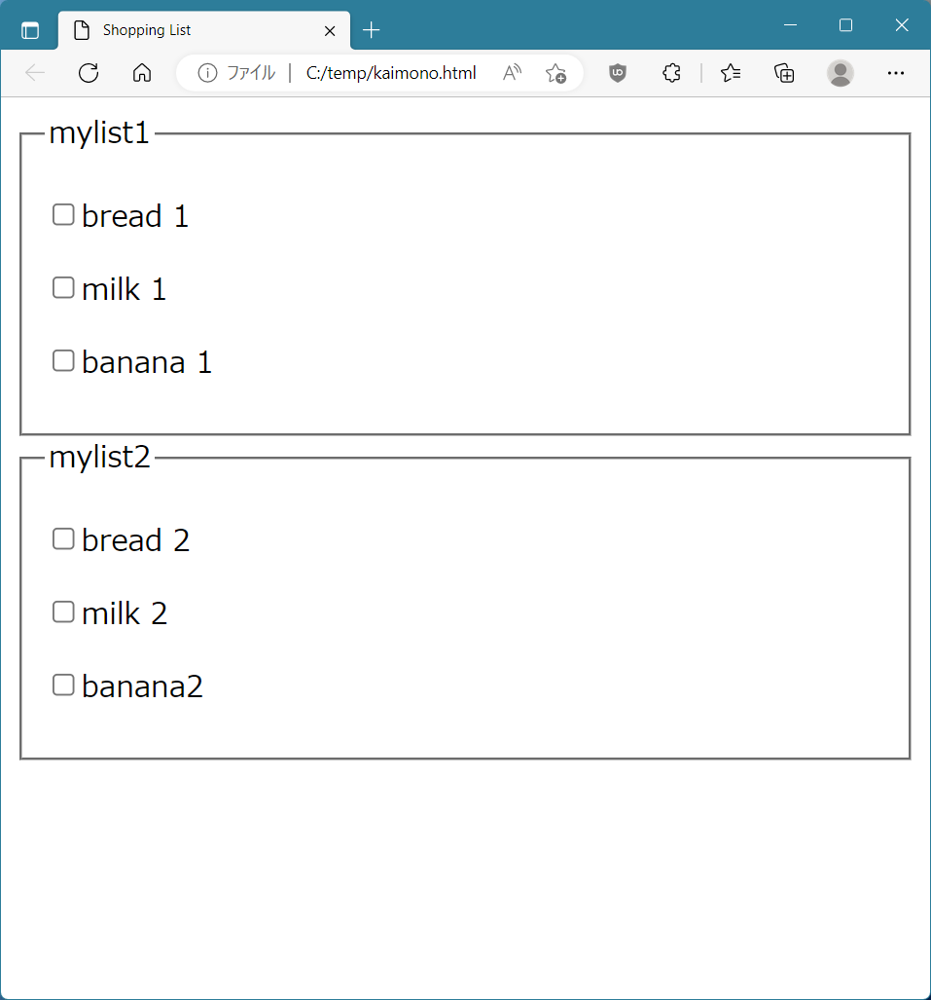

[](https://badge.fury.io/rb/kaimono)
# Kaimono

The kaimono command generates a shopping list with checkboxes from a shopping list in YAML format.

# Install

```
gem install kaimono
```

# Usage

```
kaimono <YAML format file>
```

for example
```
kaimono kaimono.yml
```

`kaimono.yml`
```
mylist1:
- bread  1
- milk   1
- banana 1

mylist2:
- bread 2
- milk  2
- banana2

```

kaimono command generates `kaimono.html`.




# License

The gem is available as open source under the terms of the [MIT License](https://opensource.org/licenses/MIT).
